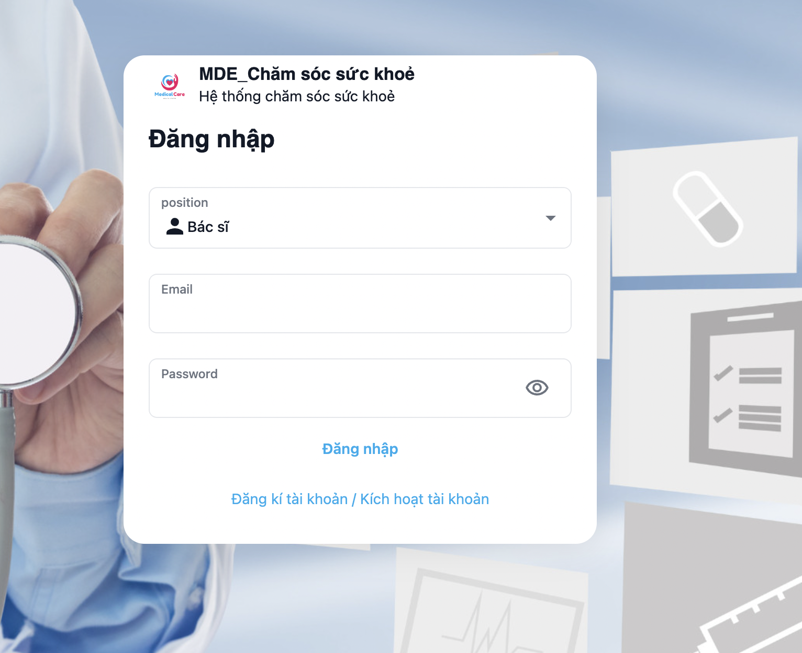
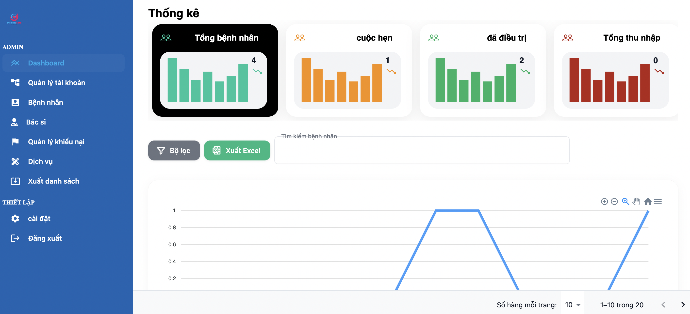
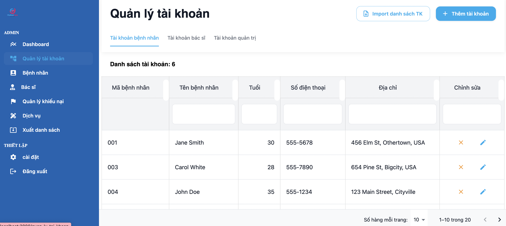
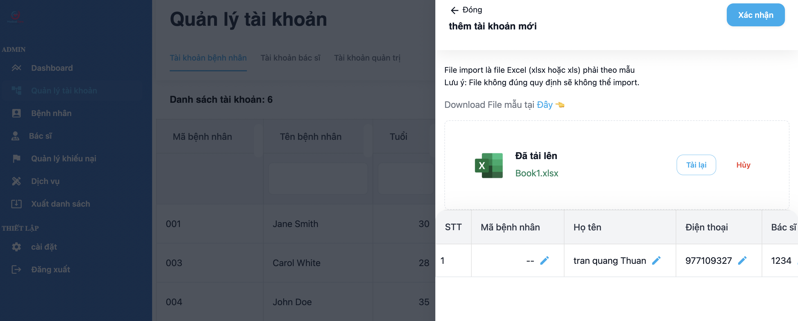
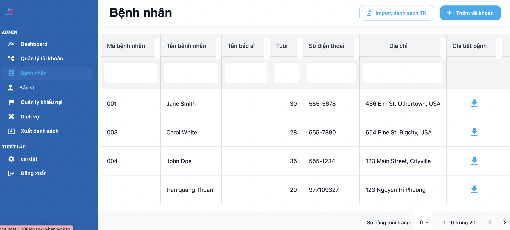
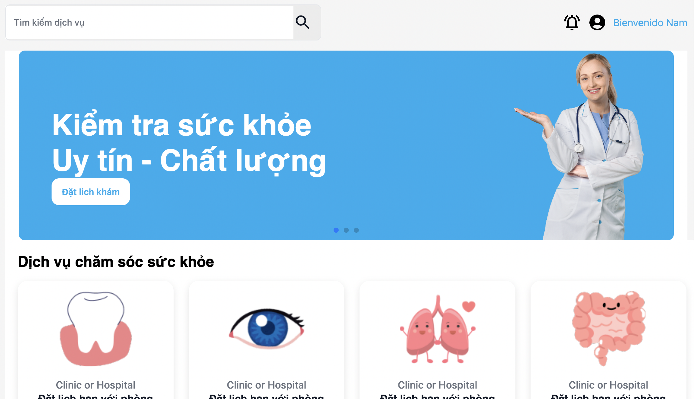
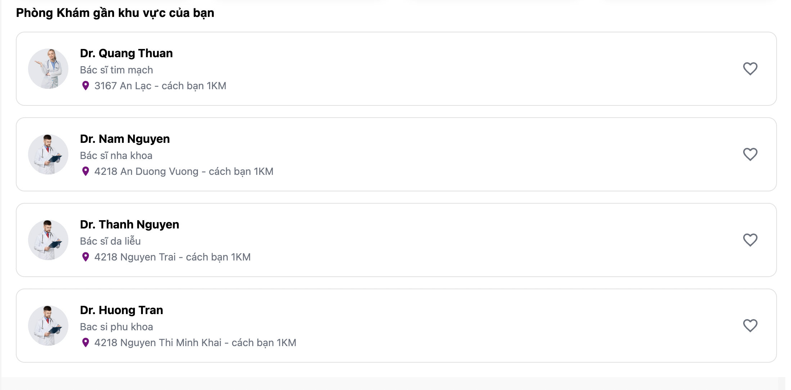
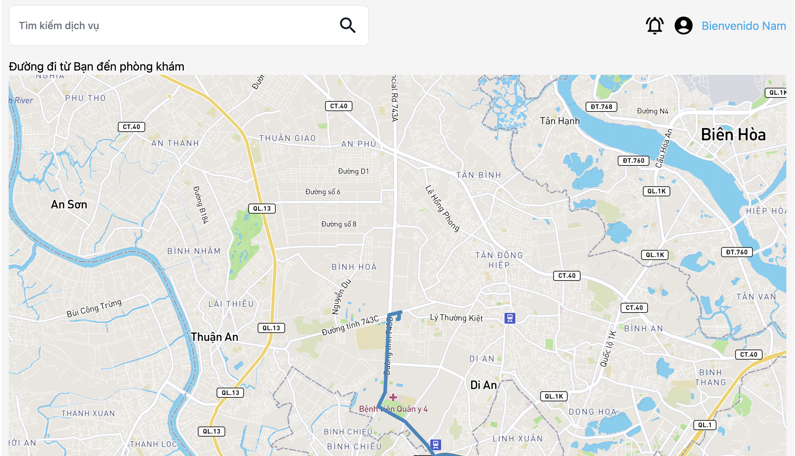
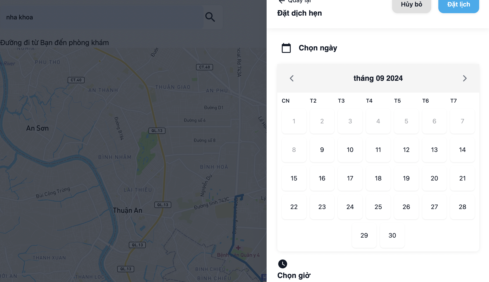

## Trần Quang Thuận
### Lời nói đầu
Đây là một website cho phép việt quản lý bệnh nhân và họ sơ bệnh án của bệnh nhân và danh sách các bác sĩ taị phòng khám.
### công nghệ sử dụng
1. Frontend: NextJs, Mui
2. Backend: nodeJs(expressJs), mongoDB
### Các chức năng của trang web
1. Login 

  

2. Thống kê người dùng

  

* Tại đây chúng ta có thể thống kê được danh sách bệnh nhân đến trong vòng 1 tháng hay là 1 năm và thu nhập của bệnh viện. Chúng ta có thể xuất danh sách các bệnh nhân ra excel. Đặt biệt có thể tìm kiếm bệnh nhân theo tên hoặc theo địa điểm.

3. Quản lý tài khoản của người dùng 

    

        
    

    

        
    

* Chúng ta có thể thêm sửa xoá thông tin tài khoản của người dùng. Đặt biệt tại đây chúng ta có thể thêm 1 hoặc nhiều tài khoản người dùng bằng cách úp load file excel hệ thống thống sẽ đọc thông tin và chuyển thành dạng bảng cho mình kiểm tra. Nếu thông tin tài khoản không đúng với format của file excel cung cấp trước thì hệ thống sẽ báo lỗi cho mình sửa.

4. Quản lý bệnh nhân và hồ sơ bệnh án

  

* chúng ta có thể xem thật chi tiết bệnh nhân đến khám tại đây. Chúng ta có thể tải hồ sơ bệnh nhân tại chi tiết bệnh 

#### Giao diện của người dùng
1. Trang chủ người dùng có thể xem được danh sách các dịch vụ và những phòng khám gần khu vực mình ở

    
    

2. Tại trang đặt lịch khám và tìm kiếm dịch vụ người dùng sẽ chọn lịch và đường đi từ vị trí người đó đến phòng khám sẽ hiển thị trên map

  
  

#### Đây là những chức năng chính của trang web ngoài ra còn một số chức năng khác nữa mình đang update từng ngày.

### Yêu cầu
1. Sử dụng NextJs 13
2. Cung cấp đường dẫn API để chạy và kiểm tra các hoạt động của trang web
### cách chạy
1. mở terminal và [Clone](git@github.com:tranquangthuan1211/manager_patient.git)
2. cd đến thư mục chứa dự án 
3. npm i hoặc yarn 
4. npm run dev hoặc yarn run dev

**Lưu ý**: Đây là dự án cá nhân của mình và đang phát triển thêm và nó chỉ mang tính chất tham khảo.